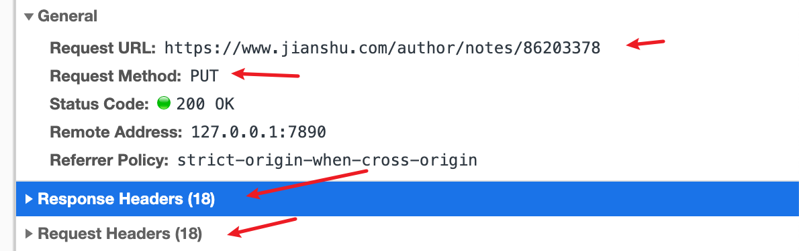

# api 接口定义示例


前言：前后端协同开发，接口定义至关重要，规范化，效率高，返工少
#### 接口组成

*方法、URL、请求参数、返回参数*


- 方法
```js
POST -- 新增
GET -- 获取
DELETE -- 删除
PUT -- 修改
```

- URL
```js
TODO - 后端小伙子来定义规范吧
```

- 请求参数
```js
{
  // 字段名   字段值      类型      解释      备注    是否必须
  userID:     200, // Number    用户ID     200      必须 
}
```

- 返回参数
```js
{
  // 字段名   字段值      类型       解释      备注    是否必须
  code:       200,   // Number    状态码     200      必须 
}
```

#### 请求/返回参数示例
```js
{
  code: 200, // 标准请求状态码，表示请求是否成功
  data: {
    status: "success", // 逻辑返回状态，用户操作后结果状态：成功/失败/无权限...
    message: "the request is right", // 提示信息：非成功一般会弹出展示给用户
    data: {  // 返回数据 无数据返回null
      pageNo: 1, // 当前页
      pageSize: 10, // 每页条数
      totalCount: 100, // 总共多少条数据
      totalPage: 10,  // 总共几页
      list: [ // 列表数据
        {
          id: 1, // 唯一值id
          name: "张三",
          status: 1, // 1:成功 0:失败
          date: 1617848685984, // 统一用时间戳
          isManager: 1,  // 1:是，0:否
          addr: null
        }
      ]
    }
  }
}
```
#### 附录：
- 常用请求返回状态码表

| 状态码 | 解释| 
| :------| :------ | 
| 200 | 请求成功 | 
| 301 | 永久重定向 | 
| 302 | 临时重定向 | 
| 400 | 错误请求（多见参数不对） | 
| 404 | 文件未找到 | 
| 500 | 内部服务器错误 |
[*完整状态码*](https://tool.oschina.net/commons?type=5)

- 常见返回参数示例以及说明
```js
// 罗列信息数据，直接返回对象即可
{
  code: 200,
  data: {
    status: "success",
    message: "the request is right",
    data: {
      name: 'aaa',
      age: 11,
      addr: '江西省大同市'
    }
  }
}
```
```js
// 列表数据，直接返回数组
{
  code: 200,
  data: {
    status: "success",
    message: "the request is right",
    data: [
      {
        id: 1, // 列表数据内数据每项需要一个唯一字段
        name: 'susan',
        age: 18,
        sex: girl,
        addr: 'my heart'
      }
    ]
  }
}
```
```js
// 列表数据+分页
{
  code: 200, // 标准请求状态码，表示请求是否成功
  data: {
    status: "success", // 逻辑返回状态，用户操作后结果状态：成功/失败/无权限...
    message: "the request is right", // 提示信息：非成功一般会弹出展示给用户
    data: {  // 返回数据 无数据返回null
      pageNo: 1, // 当前页
      pageSize: 10, // 每页条数
      totalCount: 100, // 总共多少条数据
      totalPage: 10,  // 总共几页
      list: [ // 列表数据
        {
          id: 1, // 唯一值id
          name: "张三",
          status: 1, // 1:成功 0:失败
          date: 1617848685984, // 统一用时间戳
          isManager: 1,  // 1:是，0:否
          addr: null
        }
      ]
    }
  }
}
```
```js
// 需要注意：返回Boolean类型用数字1(true)和0(false)表示，Date类型用时间戳
{
  code: 200,
  data: {
    status: "success",
    message: "the request is right",
    data: {
      isGirl: 1, // 1:true, 0: false
      birthday: 1617848685984, // 生日
    }
  }
}
```

#### 几个mock平台介绍
- **easy-mock** 大搜车 无数据校验，正常mock功能，有固定的前缀和后面自定义的uri ，没有对于传入参数的配置，只有返回值的配置
地址：[https://github.com/easy-mock/easy-mock](https://github.com/easy-mock/easy-mock)
- **Api-mocker** 丁香园 有数据校验，但是url不固定，且不显示uri。有传入参数的配置，也有返回参数的配置
地址：[https://github.com/DXY-F2E/api-mocker](https://github.com/DXY-F2E/api-mocker)
- **eoLinker** 广州银云 专业版有数据校验，uri前缀固定，后面自定义的uri
地址：请自行搜索
- **RAP2-DELOS** 阿里妈妈前端团队出品的开源接口管理工具RAP第二代 , 具有请求参数设置, 参数校验, 同一项目里url前缀也是固定的, 很棒的项目
地址：[https://github.com/thx/rap2-delos](https://github.com/thx/rap2-delos)

#### 参考文章
[https://www.jianshu.com/p/bfea560e81d0](https://www.jianshu.com/p/bfea560e81d0)
[https://www.zhihu.com/question/52409287](https://www.zhihu.com/question/52409287)
[https://www.jianshu.com/p/15ebd51ea733](https://www.jianshu.com/p/15ebd51ea733)