# ps MacOS系统安装教程

*前提：*[下载ps]()

1. macOS Sierra系统在系统偏好设置中的“安全与隐私”模块里，默认关闭了允许“任何来源”App，并为隐藏状态。如果不开启，会导致在安装或者运行一些第三方软件的时候出现错误。【提示：打开第三方软件的时候经常报错为“该镜像已损坏，请移至废纸篓”】
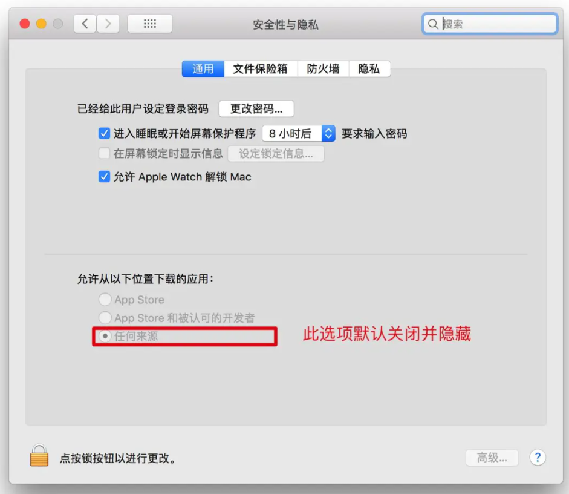
2. 要开启这个选项，需要先打开终端，在命令行里输入 `sudo spctl --master-disable` 后，按下`enter`键（回车键），输入电脑开机密码，按下`enter`键即可。【提示：输入密码时，不会显示输入状态】
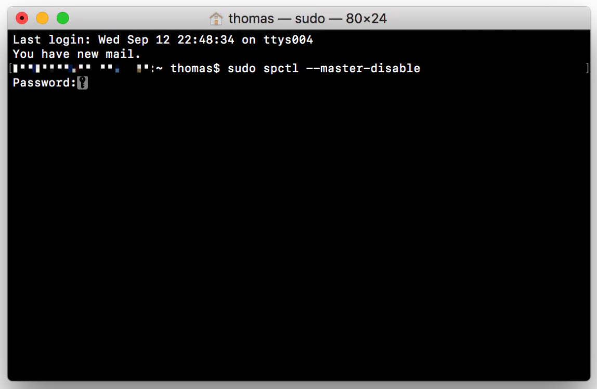
3. 运行完成后，在“安全与隐私”中，即可看见已经选择“任何来源”选项。这样就可以安装一些第三方软件了。
4. 双击打开下载好的安装包
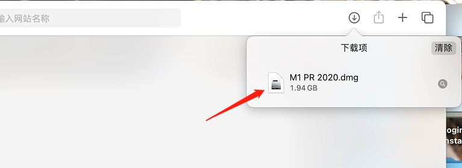
5. 右键单击【`Install`】并点选“显示包内容”, **(切莫双击打开！切莫双击打开！切莫双击打开！)**
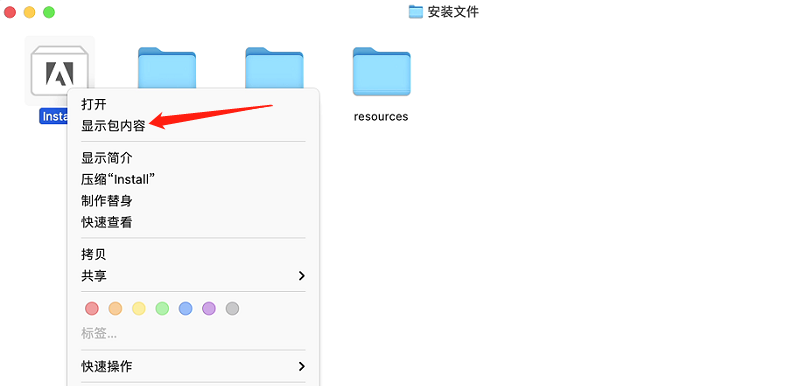
6. 6.分别进入 `Contents` > `MacOS` 目录并双击`Install`文件进行安装
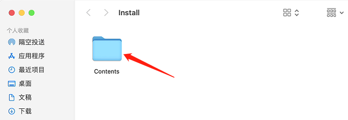
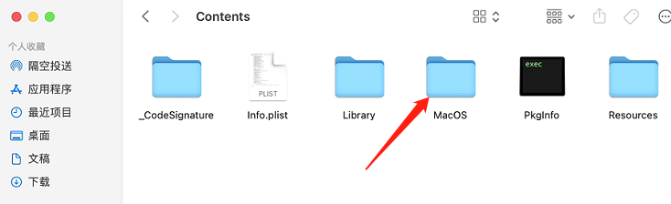
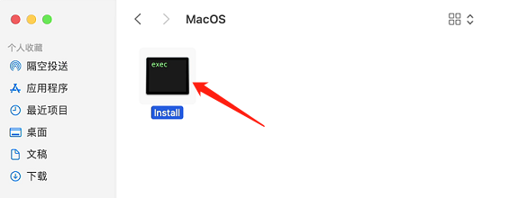
7. 输入**开机密码** 后点击**好**按钮
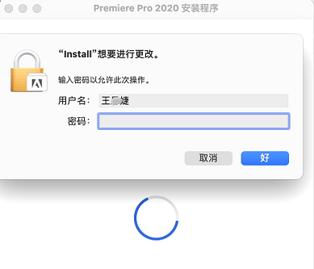
8. 点击 **继续** 按钮进行安装 （**如果需要登录，按提示注册并登录Adobe账号**）
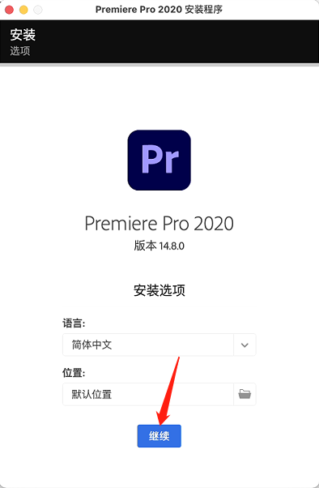
9. 在 **访达** 中点击 **应用程序** 并找到安装好的软件打开即可使用
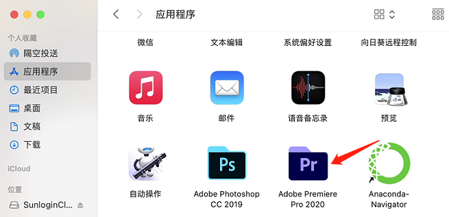
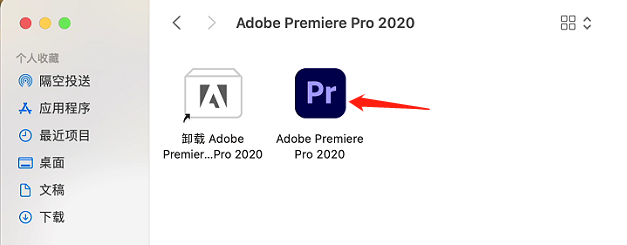
10. 至此，软件已成功安装，双击即可使用，且永久免费，其它软件安装步骤与以上步骤一样
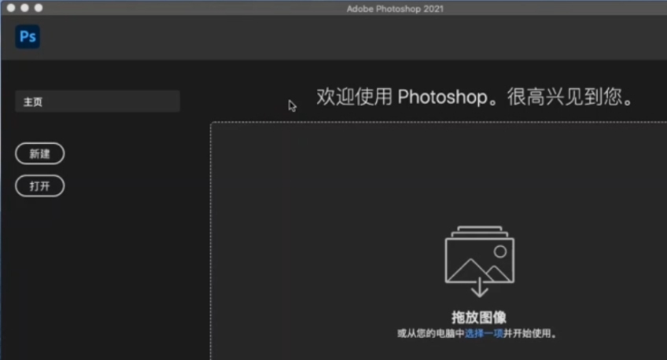

参考：
[https://www.yuque.com/books/share/0724a9b2-dd68-45aa-8486-02525a30c775/txnvs1](https://www.yuque.com/books/share/0724a9b2-dd68-45aa-8486-02525a30c775/txnvs1)