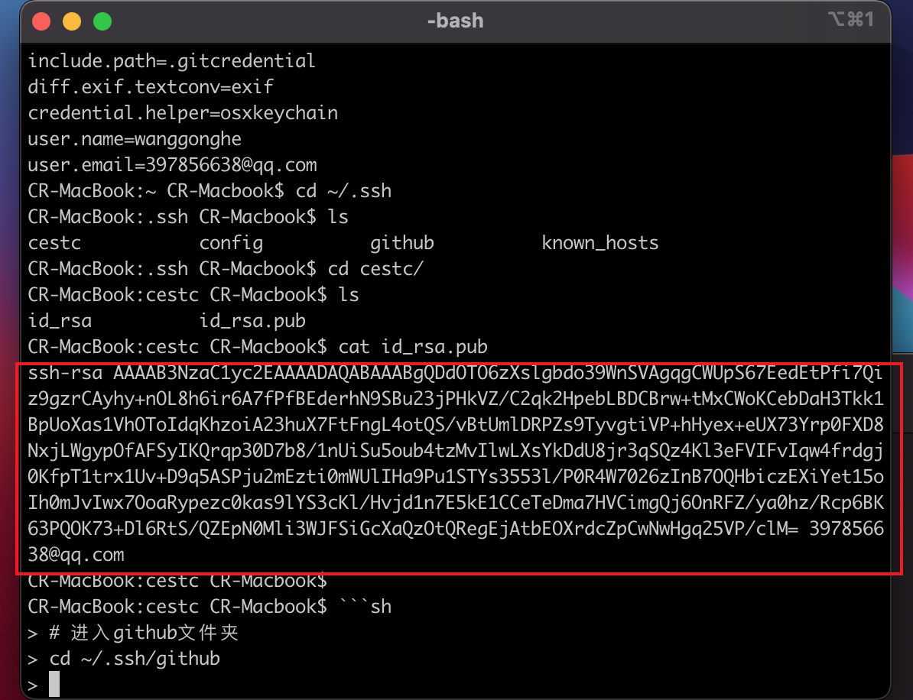

# ssh-keys的配置

*平时开发可能需要连接多个仓库，github/gitlab/公司git库 等，一般情况下，一对公钥id_rsa.pub和私钥id_rsa对应着一个Git托管平台(比如GitHub、GitLab等)。若我们需要在一台电脑上操作多个Git托管平台，只需配置多对公钥和私钥，也即配置多个ssh keys。下面就是配置多个ssh-keys的方式*

## 生成`ssh keys`，并在对应仓库配置
```sh
# 进入根目录
cd ~/.ssh
```
```sh
# 创建github文件夹
mkdir github
```
```sh
# 进入github文件夹
cd ~/.ssh/github
```
```sh
# 生成github公钥,然后一路回车
ssh-keygen -t rsa -C "你的邮箱" -f ~/.ssh/github/id_rsa
```
```sh
# 查看并复制生成的id_rsa.pub内容
cat ~/.ssh/github/id_rsa.pub
```


打开`github`网站[https://github.com/settings/ssh/new](https://github.com/settings/ssh/new)创建`ssh keys`，并粘贴刚刚复制的`ssh-rsa`，点击创建即可

**同样的方法创建其他仓库`ssh keys`和配置**

## 配置多`ssh keys`的配置文件 `config`
```sh
# 进入到`ssh`根目录
cd ~/.ssh
```
```sh
# 创建`config`文件
touch ~/.ssh/config
```
```sh
# 编辑`config`文件
vi ~/.ssh/config
```
```sh
# 把下面的内容粘贴进去
# 配置github
Host github.com
HostName github.com
PreferredAuthentications publickey
IdentityFile ~/.ssh/github/id_rsa

# 配置gitlab
Host gitlab.com
HostName gitlab.com
PreferredAuthentications publickey
IdentityFile ~/.ssh/gitlab/id_rsa
```

## 测试
```sh
# github
ssh -T git@github.com

# 其他...
```
如果提示以下内容，则成功
```sh
Hi xxx! You've successfully authenticated, but GitHub does not provide shell access.
```

## 删除全局的`id_rsa`(可选)
```sh
cd ~/.ssh
ls
rm id_rsa
rm id_rsa.pub
```