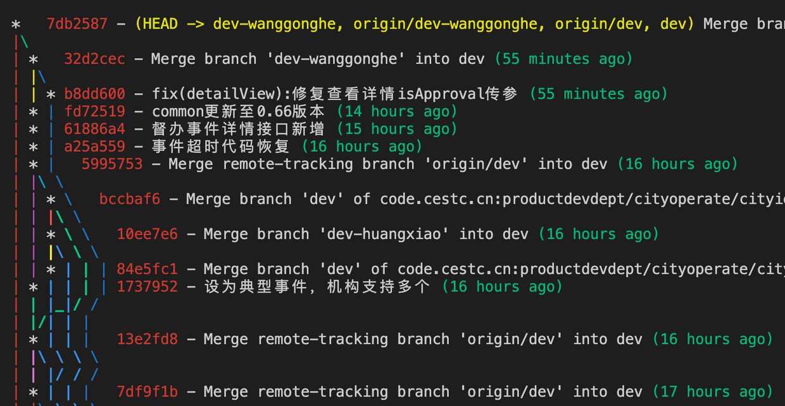
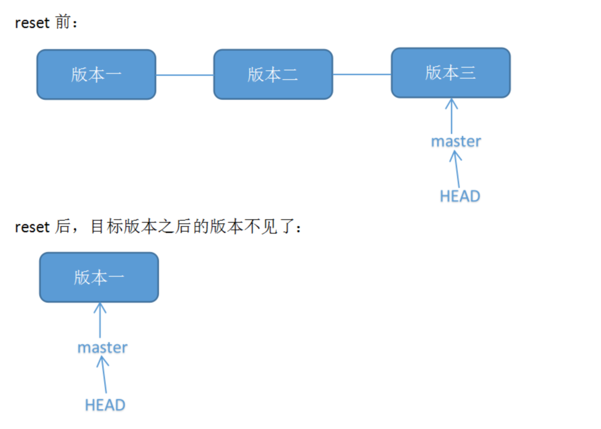
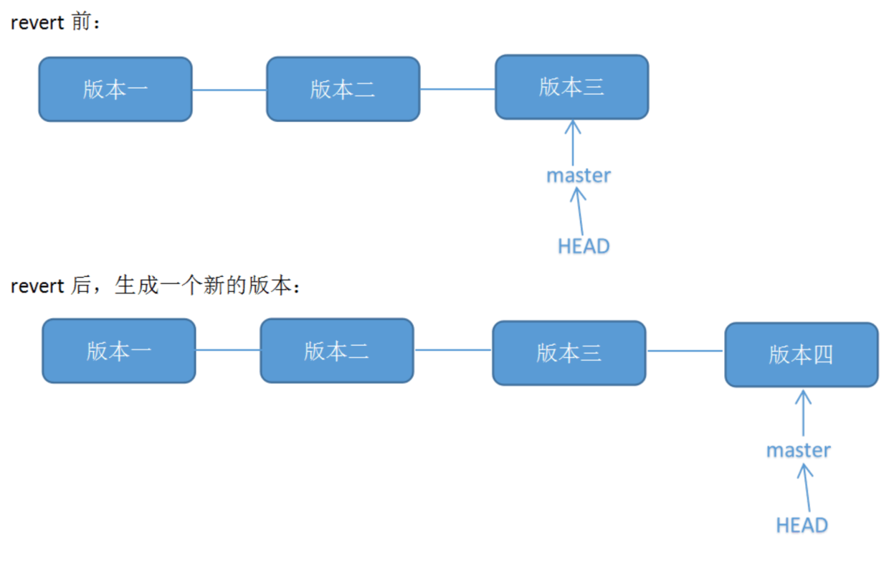

# git常用命令

- 查看某个人的提交记录log
```
git log --author=“author”
```

```
git log --graph --pretty=format:'%Cred%h%Creset -%C(yellow)%d%Creset %s %Cgreen(%cr)%Creset' --abbrev-commit --date=relative
```
- gitignore修改不生效解决方法
```
git rm -r --cached .
 
git add .
 
git commit -m '备注'
```

- 回滚的常见操作
```
// 暂存区的目录树会被重写，最后一次提交的内容会被丢弃，但是工作区不受影响
git reset HEAD~1

// 暂存区和工作目录都同步到你指定的提交
git reset --hard HEAD~1

// 回退到某次提交
git reset commit
// 然后强制推送
git push -f

// revert方式，git revert是用于“反做”某一个版本，以达到撤销该版本的修改的目的。比如，我们commit了三个版本（版本一、版本二、 版本三），突然发现版本二不行（如：有bug），想要撤销版本二，但又不想影响撤销版本三的提交，就可以用 git revert 命令来反做版本二，生成新的版本四，这个版本四里会保留版本三的东西，但撤销了版本二的东西
git revert commit 
//然后修改后提交
git commit -m '备注'
// 推送到远端
git push
```
- reset和revert区别


