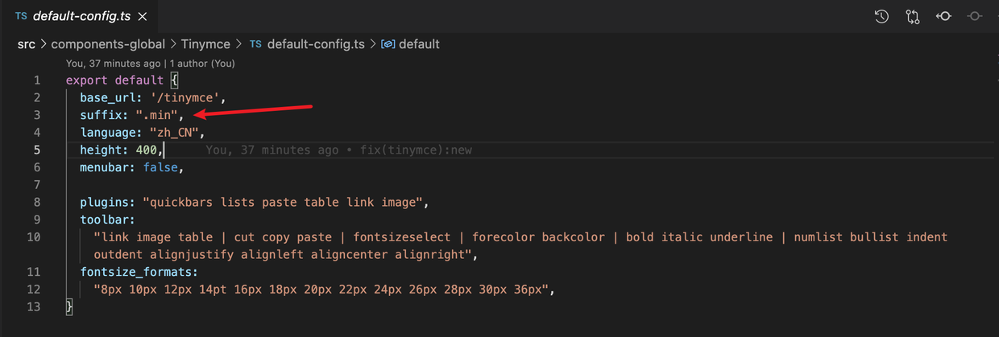
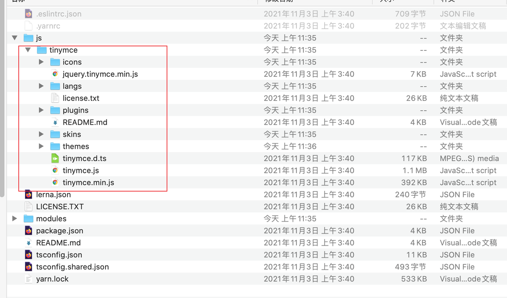

# tinymce离线vue3-ts组件实现过程

本来想用tinymce的vue版本直接用的，可是应用过后出现一系列的问题：
  - 需要申请 api-key
  - 网络加载过慢
  - 依赖网络

所以，决定配置一套离线版的tinymce！

## 步骤
  - 项目基础
  ```js
    vue3+ts+elementUI
  ```

1. 第一步：下载离线版的tinymce
  [https://www.tiny.cloud/get-tiny/self-hosted/](https://www.tiny.cloud/get-tiny/self-hosted/)
  注意：可以下载`Dev`版本，也可以下载`Prod`，`tinymce.js`默认加载原始文件，不加载压缩过后`.min`的文件；
  **如果要下载`Dev`的话，需要添加配置如下代码：**



2. 第二步：整理目录
   把下面红圈里的文件复制出来，放到项目的`/public`目录下
  

3. 第三步：下载中文包
[https://www.tiny.cloud/get-tiny/language-packages/](https://www.tiny.cloud/get-tiny/language-packages/)
并把下载好的`zh_CN.js`文件放在项目`/public/tinymce/langs/`下面

4. 使用`@tinymce/tinymce-vue`组件
```vue
<template>
  <Editor v-model="val" :init="config" :id="eid" />
</template>

<script lang="ts">
import { computed, watch, onMounted } from "vue";
import "/@public/tinymce/tinymce.min";
import Editor from "@tinymce/tinymce-vue";
import "/@public/tinymce/tinymce.d";

declare global {
  interface Window {
    tinymce: any;
  }
}

import configDefault from "./default-config";
import getUploadHandler from "./getUploadHandler";

export default {
  components: {
    Editor,
  },
  props: {
    value: {
      type: String,
      default: "",
    },
    disabled: {
      type: Boolean,
      default: false,
    },
    uploadUrl: {
      type: String,
      default: "",
    },
    init: {
      type: Object,
      default() {
        return {};
      },
    },
  },
  emits: ["update:value"],
  setup(props: any, context: any) {
    const eid = Date.now();

    // 双向绑定
    const val = computed({
      get() {
        return props.value;
      },
      set(newVal: string) {
        context.emit("update:value", newVal);
      },
    });

    // 配置对象
    const config = computed(() => {
      const obj = Object.assign(configDefault, props.init);
      obj.images_upload_handler = getUploadHandler(props.uploadUrl);

      return obj;
    });

    // 监听disabled
    watch(
      () => props.disabled,
      (val: boolean) => {
        if (window.tinymce.editors && window.tinymce.editors[eid])
          window.tinymce.editors[eid].setMode(val ? "readonly" : "design");
      }
    );

    onMounted(() => {
      window.tinymce.editors[eid].setMode(val ? "readonly" : "design");
    });

    return {
      val,
      config,
      eid,
    };
  },
};
</script>
```
   - **附件**：
 ```js
// default-config.ts
export default {
  base_url: '/tinymce',
  suffix: ".min",
  language: "zh_CN",
  height: 400,
  menubar: false,

  plugins: "quickbars lists paste table link image",
  toolbar:
    "link image table | cut copy paste | fontsizeselect | forecolor backcolor | bold italic underline | numlist bullist indent outdent alignjustify alignleft aligncenter alignright",
  fontsize_formats:
    "8px 10px 12px 14pt 16px 18px 20px 22px 24px 26px 28px 30px 36px",
}
```
```js
// getUploadHandler.ts
const getUploadHandler = (uploadUrl: string): any => {
  return (
    blobInfo: any,
    success: any,
    failure: any,
    progress: any
  ) => {

    let xhr: any, formData: any;
    xhr = new XMLHttpRequest();
    xhr.withCredentials = false;
    xhr.open("POST", uploadUrl);

    xhr.upload.onprogress = function (e: any) {
      progress((e.loaded / e.total) * 100);
    };

    xhr.onload = function () {
      var json;
      if (xhr.status == 403) {
        failure("HTTP Error: " + xhr.status, { remove: true });
        return;
      }
      if (xhr.status < 200 || xhr.status >= 300) {
        failure("HTTP Error: " + xhr.status);
        return;
      }
      json = JSON.parse(xhr.responseText);
      const url = json.data.url;
      if (!json || typeof url != "string") {
        failure("Invalid JSON: " + xhr.responseText);
        return;
      }
      success(url);
    };

    xhr.onerror = function () {
      failure(
        "Image upload failed due to a XHR Transport error. Code: " +
        xhr.status
      );
    };

    formData = new FormData();
    formData.append("file", blobInfo.blob(), blobInfo.filename());

    xhr.send(formData);
  }
}

export default getUploadHandler
```
5. 优化
    - 自动刷新
    - 更多配置：[http://tinymce.ax-z.cn/](http://tinymce.ax-z.cn/)

6. 参考资料
    - [https://www.tiny.cloud/docs/quick-start/](https://www.tiny.cloud/docs/quick-start/)
    - [https://blog.csdn.net/feixiangsmile/article/details/100129218](https://blog.csdn.net/feixiangsmile/article/details/100129218)
    - [https://segmentfault.com/a/1190000012791569](https://segmentfault.com/a/1190000012791569)